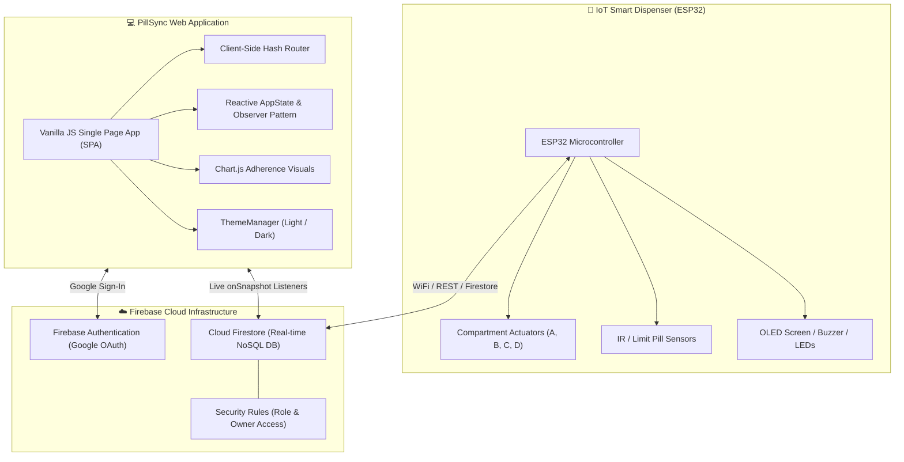

# 💊 PillSync — Smart IoT Pill Dispenser & Medication Manager

[](https://opensource.org/licenses/MIT)
[](https://developer.mozilla.org/en-US/docs/Web/JavaScript)
[](https://firebase.google.com/)
[](https://www.espressif.com/)
[](https://www.chartjs.org/)

**PillSync** (also known as *PillDispenser*) is an intelligent, full-stack IoT medication management platform built to help elderly individuals, patients with chronic illnesses, and caregivers seamlessly track, dispense, and manage daily medications.

By connecting a multi-compartment **ESP32-powered smart pill dispenser** with a modern, real-time web application, PillSync ensures patients never miss a dose, eliminates accidental double-dosing, and provides peace of mind to family members and healthcare providers.

---

## 📑 Table of Contents

- [Key Features](#-key-features)
- [System Architecture](#-system-architecture)
- [Tech Stack](#-tech-stack)
- [Hardware & IoT Integration](#-hardware--iot-integration)
- [Firestore Data Model & Security](#-firestore-data-model--security)
- [Project Directory Structure](#-project-directory-structure)
- [Getting Started & Local Setup](#-getting-started--local-setup)
- [User Roles & Workflows](#-user-roles--workflows)
- [UI & Accessibility Features](#-ui--accessibility-features)
- [Roadmap & Future Enhancements](#-roadmap--future-enhancements)
- [Contributing & License](#-contributing--license)

---

## ✨ Key Features

### 🕒 1. Real-Time Daily Dose Scheduling
- **Automated Schedule Generation**: Dynamically constructs daily dose queues based on user medication schedules and day-of-week rules.
- **Actionable Dose Controls**: One-tap dose logging (`Mark as Taken`, `Skip`, or automated `Missed` status if overdue by >30 minutes).
- **Hero Next-Dose Card**: Prominent countdown timer and instructions for the immediate upcoming dose.

### 💊 2. Comprehensive Medication Management
- **Detailed Medicine Catalog**: Track generic & brand names, dosages, prescribing doctors, specific intake instructions (e.g., *"Take with meals"*), and custom color codes.
- **Compartment Mapping**: Map each medication to physical dispenser slots (**Compartment A, B, C, or D**).
- **Inventory & Refill Alerts**: Real-time pill count tracking with automatic warnings when pill stock drops below refill thresholds.

### 📊 3. Interactive Adherence Analytics & History
- **7-Day & 14-Day Visual Insights**: Interactive bar and adherence trend charts powered by **Chart.js**.
- **Historical Logs**: Comprehensive audit trail of taken, skipped, and missed doses for clinical reviews and doctor appointments.
- **Adherence Percentage Calculation**: Real-time adherence scores to reward consistency and flag care concerns early.

### 👥 4. Caregiver Portal & Remote Monitoring
- **Dual-Role Architecture**: Switch between **Patient** and **Caregiver** workflows.
- **Remote Telemetry & Oversight**: Caregivers can view patient adherence rates, upcoming doses, missed dose alerts, and physical dispenser inventory in real time.
- **Direct Caregiver Linking**: Secure email-based linking between patients and their caregivers.

### 🔔 5. Proactive Alerts & Notification Hub
- **Missed Dose Warnings**: Instant alerts if a dose is missed beyond the grace period.
- **Refill Reminders**: Timely alerts before a medication runs out.
- **Audible & Visual Cues**: Hardware buzzer/LED sync with web-based toast notifications.

### 🌓 6. High-Contrast Accessible Design & Dark Mode
- **Elderly-Friendly UI**: High-contrast typography, large touch targets (minimum 44px), intuitive iconography, and screen-reader accessibility.
- **Theme Switching**: System-aware and persistent Light / Dark mode toggle.
- **Responsive Layout**: Desktop sidebar navigation with mobile bottom navigation bar.

---

## 🏗️ System Architecture



---

## 💻 Tech Stack

| Layer | Technology | Details |
| :--- | :--- | :--- |
| **Frontend Core** | Vanilla JavaScript (ES6+), HTML5 | Zero build-step requirement, high performance, native DOM |
| **Styling** | Custom CSS3 (Vanilla) | CSS Variables, Flexbox/CSS Grid, Glassmorphism, Responsive Shell |
| **Charts & Graphs** | [Chart.js v4.4.0](https://www.chartjs.org/) | Responsive canvas charts for weekly adherence trends |
| **Authentication** | [Firebase Auth v12](https://firebase.google.com/docs/auth) | Google OAuth Popup & Redirect with secure session persistence |
| **Database** | [Cloud Firestore v12](https://firebase.google.com/docs/firestore) | Real-time database with live `onSnapshot` subscriptions |
| **Security** | Firestore Security Rules | Fine-grained ownership and caregiver-verified read-only permissions |
| **Hardware Controller** | ESP32 MCU | Wi-Fi enabled microcontroller controlling 4 dispensing compartments |

---

## 🤖 Hardware & IoT Integration

The Pill Dispenser hardware unit is designed around an **ESP32 microcontroller** configured with:

1. **4 Motorized Compartments (A, B, C, D)**:
   - Micro servo/stepper motors rotate or slide open the corresponding compartment slot upon scheduled dose execution or web trigger.
2. **Dispense Verification**:
   - Infrared (IR) break-beam or optical limit switches detect when pills fall into the dispensing cup.
3. **Local Indicators**:
   - **Buzzer/Audio**: Emits gentle melodic reminders at dose time.
   - **LED Ring / Status LEDs**: Visual indicators per compartment highlighting which medication to take.
   - **OLED / LCD Screen**: Displays medicine name, dosage, and current time.
4. **Device Telemetry Tracked in Web App**:
   - **Battery Level** (e.g. `87%` battery remaining)
   - **Wi-Fi Signal Strength** (`Strong`, `Fair`, `Weak`)
   - **Firmware Version** (e.g. `v2.1.4`)
   - **Last Sync Timestamp** (live synchronization heartbeat)

---

## 🗄️ Firestore Data Model & Security

### Collection Hierarchy

```
users/{uid}
 ├── (document) User Profile (name, email, role, caregiverEmail, conditions)
 │
 ├── medicines/{medId}
 │    └── (document) { name, dosage, compartment, color, frequency, times, active, pillCount, refillDate, ... }
 │
 └── schedule/{date}
      └── doses/{doseId}
           └── (document) { medicineId, medicineName, dosage, compartment, scheduledTime, status, takenAt, ... }
```

### Security Rules Summary (`firestore.rules`)

- **Owner Control**: Authenticated users have full `read` and `write` access to their own profile, medicines catalog, and schedule history.
- **Caregiver Access**: When a patient lists a caregiver's email address in their `caregiverEmail` field, that caregiver receives **read-only** permission to inspect the patient's adherence logs, dose status, and medication lists.
- **Zero Caregiver Write Privileges**: Caregivers cannot alter doses or change prescriptions to protect clinical safety.
- **Default Deny**: All unspecified documents and unauthorized requests are rejected by default.

---

## 📂 Project Directory Structure

```text
Pill-Dispenser/
├── index.html              # Main application entry point & semantic HTML shell
├── firestore.rules         # Cloud Firestore security rules
├── README.md               # Comprehensive project documentation
├── css/
│   ├── base.css            # Typography, resets, global base styling
│   ├── components.css      # Buttons, cards, modals, form controls, toast alerts
│   ├── layout.css          # Desktop sidebar, top bar, mobile bottom nav layout
│   ├── pages.css           # Page-specific views & responsive breakpoints
│   └── variables.css       # Design tokens, color palette, dark/light theme variables
└── js/
    ├── app.js              # Application bootstrapper and lifecycle manager
    ├── components.js       # Reusable UI components (Modals, Toasts, Badges, Cards)
    ├── data.js             # Mock seed data for Demo Mode & offline fallback
    ├── firebase.js         # Firebase v12 bootstrap, Auth, and Firestore DB service
    ├── router.js           # Client-side hash router with route guards
    ├── state.js            # Central reactive state store with event emitters
    ├── theme.js            # Theme manager for Light/Dark mode transitions
    └── pages/
        ├── auth.js         # Login, Sign Up, and Google OAuth UI
        ├── caregiver.js    # Caregiver portal and patient oversight dashboard
        ├── dashboard.js    # Patient home dashboard, next-dose card, daily queue
        ├── landing.js      # Landing & onboarding hero screen
        ├── medications.js  # Medicine CRUD catalog and compartment manager
        ├── reminders.js    # Alert list, missed-dose resolution, and refill warnings
        ├── schedule.js     # Adherence history, calendar log, and Chart.js view
        └── settings.js     # User profile, device telemetry, and notification settings
```

---

## 🚀 Getting Started & Local Setup

### Prerequisites
- Modern web browser (Chrome, Firefox, Edge, Safari).
- A static HTTP server (e.g., VS Code Live Server, Node `http-server`, or Python `http.server`).
- *(Optional)* Firebase account if configuring your own backend.

### 1. Clone the Repository
```bash
git clone https://github.com/SaiSujith97/Pill-Dispenser.git
cd Pill-Dispenser
git checkout laxith
```

### 2. Run Locally
Because the project uses standard ES Modules (`firebase.js`), serve the folder over HTTP/HTTPS:

**Using Python:**
```bash
# Python 3
python -m http.server 8080
```

**Using Node.js (npx):**
```bash
npx serve .
```

**Using VS Code:**
- Install the **Live Server** extension.
- Right-click `index.html` and select **"Open with Live Server"**.

### 3. Open in Browser
Navigate to `http://localhost:8080` (or the port provided by your local server).

### 4. Interactive Demo Mode
Want to test the app without signing into Google/Firebase?
- On the landing page, click **"✦ Skip to demo dashboard"**.
- This instantly populates mock medicines, daily dose schedules, 14-day history, and device telemetry.

---

## 👥 User Roles & Workflows

### 🏥 Patient Experience
1. **View Today's Plan**: Check current and upcoming doses directly on the home screen.
2. **Log Doses**: Mark doses as `Taken` or `Skipped` with a single tap.
3. **Manage Prescriptions**: Add new medicines with compartment assignments (A/B/C/D), set daily intake times, and log pill counts.
4. **Track Adherence**: Review weekly compliance percentages and identify missed medication patterns.

### 🤝 Caregiver Experience
1. **Remote Dashboard**: View live adherence scores of linked patients.
2. **Missed Dose Alerts**: Instant notifications when a patient misses their scheduled window.
3. **Refill Monitoring**: Monitor remaining pill quantities in each dispenser compartment to order refills in advance.
4. **Device Health Check**: Ensure the physical dispenser is online and connected to Wi-Fi.

---

## 🎨 UI & Accessibility Features

- **Elderly-Centric Typography**: Uses `Inter` with high-contrast font weights and increased line heights for superior legibility.
- **Large Touch Targets**: All interactive buttons, checkboxes, and links meet WCAG 2.1 AA target size recommendations (>= 44x44px).
- **Color Coding & Iconography**: Each compartment and status is paired with distinct colors *and* symbols so users with color vision deficiencies can easily differentiate them.
- **Live ARIA Announcements**: Screen readers receive dynamic announcements for toast messages, countdowns, and dose confirmations.

---

## 🔮 Roadmap & Future Enhancements

- [ ] **Web Push & FCM Alerts**: Background push notifications on mobile and desktop browsers when medication is due.
- [ ] **Twilio SMS / WhatsApp Fallback**: Automated SMS or WhatsApp messages to caregivers if critical medications remain untaken.
- [ ] **RFID / NFC Patient Badge**: Scan patient wristband on the physical dispenser to unlock and release medication.
- [ ] **Voice Assistant Integration**: Alexa and Google Assistant voice prompts (*"Alexa, did I take my morning pills?"*).
- [ ] **Prescription Barcode Scanner**: Camera-based medicine barcode recognition to auto-fill medication details.

---

## 📄 License & Attribution

This project is licensed under the **MIT License** — feel free to use, modify, and distribute with attribution.

Developed with ❤️ for better health and caregiver peace of mind.
